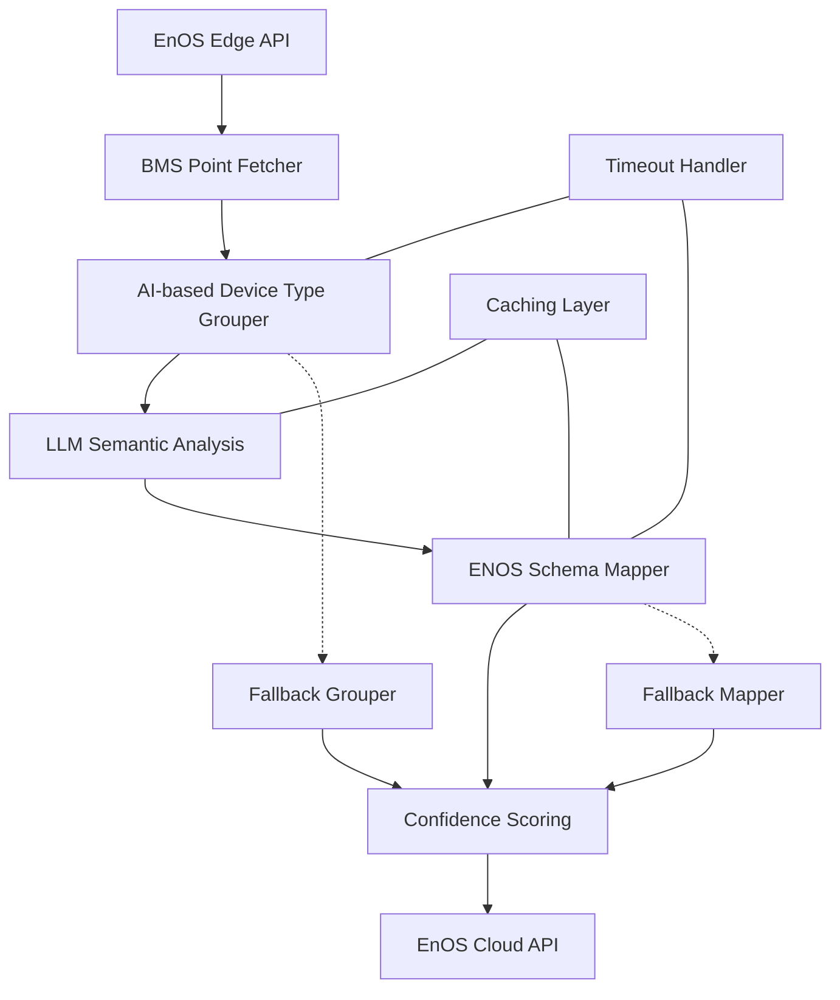
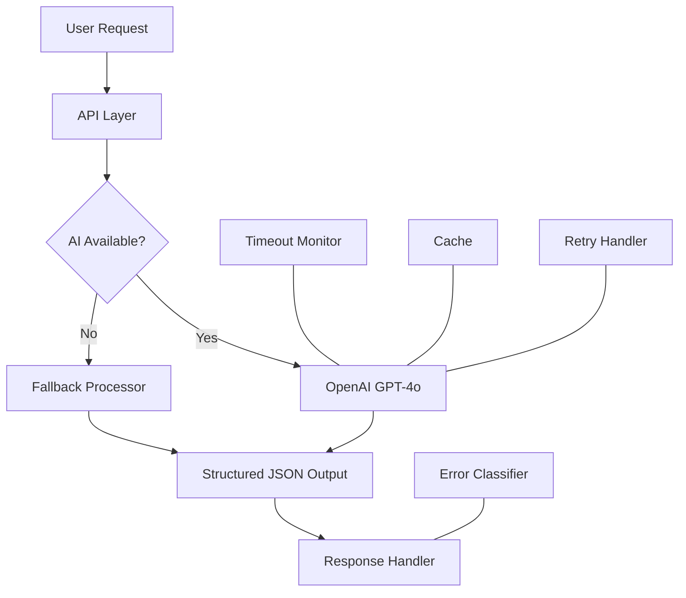
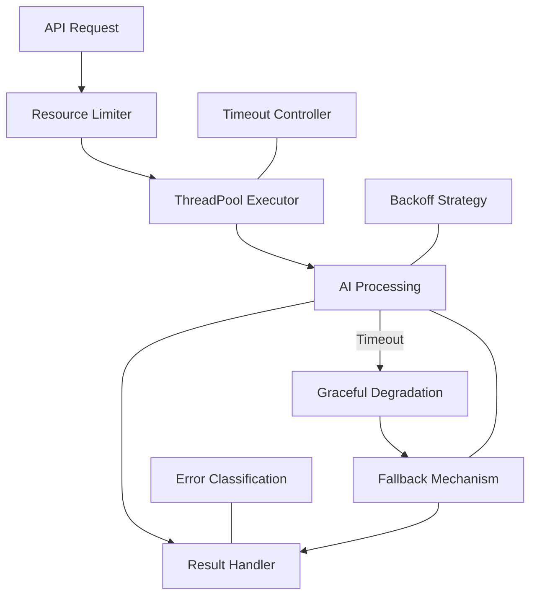

# Backend Architecture

## 1. Service Components
```python
class BackendServices:
    """
    Core service architecture using Python 3.10+
    Components maintained in 100% test coverage
    Enhanced with AI-based BMS processing capabilities
    Resilient with fallback mechanisms and timeout handling
    """
    API_GATEWAY = "Flask + Gunicorn"
    BMS_PROCESSOR = "AI-based BMS Grouping/Mapping Engine"
    TASK_QUEUE = "Celery + Redis"
    DATA_LAYER = "SQLAlchemy + Postgres"
    ENOS_ADAPTER = "EnOS API Client"
    LLM_SERVICE = "OpenAI GPT-4o"
    MAPPING_SERVICE = "AI Mapping Validator"
    AUTH_SERVICE = "JWT + OAuth2"
    RESILIENCE_LAYER = "ThreadPoolExecutor + Timeout Handling"
```

## 2. Enhanced Data Flow


## 3. BMS Processing Targets
| Operation           | 1k Points | 10k Points | 100k Points |
|---------------------|-----------|------------|-------------|
| AI Device Grouping  | 5s        | 25s        | 180s        |
| Semantic Analysis   | 7s        | 35s        | 250s        |
| Schema Mapping      | 8s        | 40s        | 300s        |
| Fallback Processing | 200ms     | 1.8s       | 18s         |

## 4. Performance Targets
| Component           | RPS Target | Error Budget | P99 Latency |
|---------------------|------------|--------------|-------------|
| API Gateway         | 1000       | 0.1%         | <200ms      |
| Batch Processing    | 50         | 1%           | <5s         |
| AI Inference        | 20         | 5%           | <2s         |
| Fallback Processing | 100        | 2%           | <300ms      |

## 5. AI Integration Architecture


## 6. Resilience Architecture
