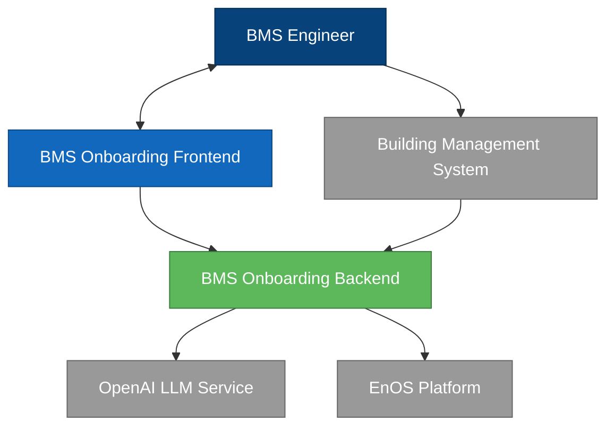
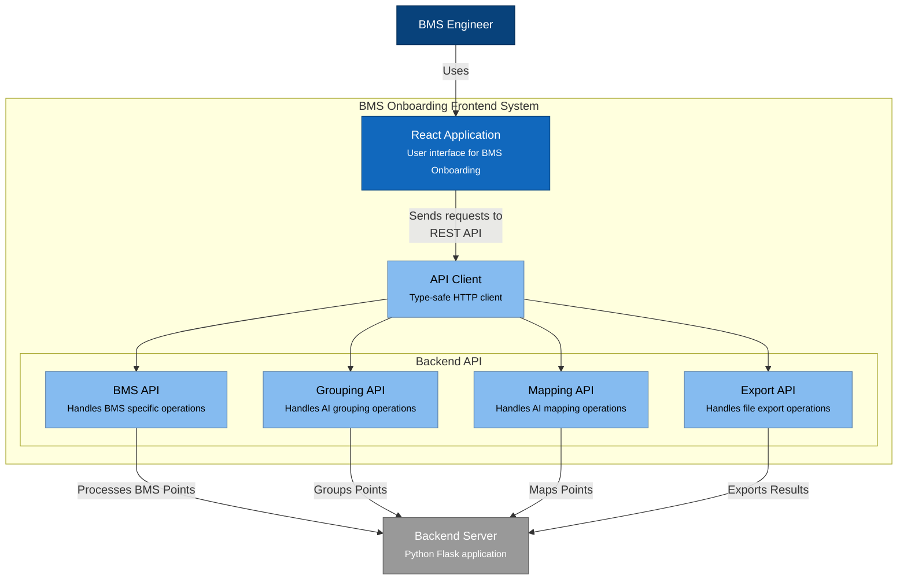
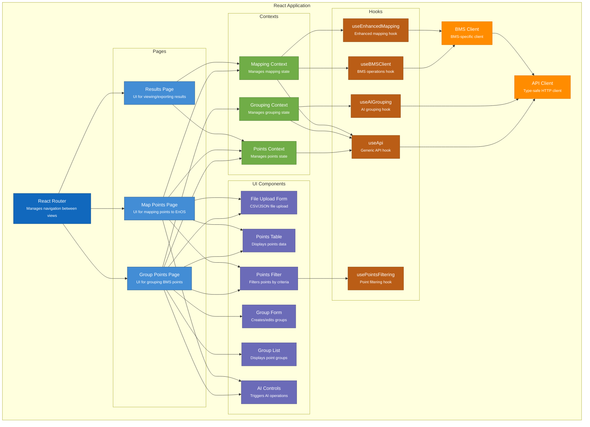
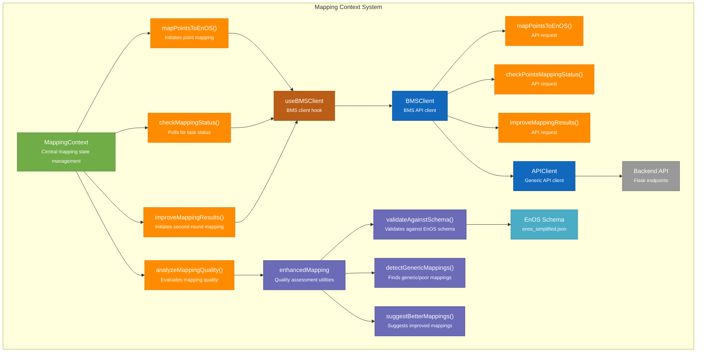
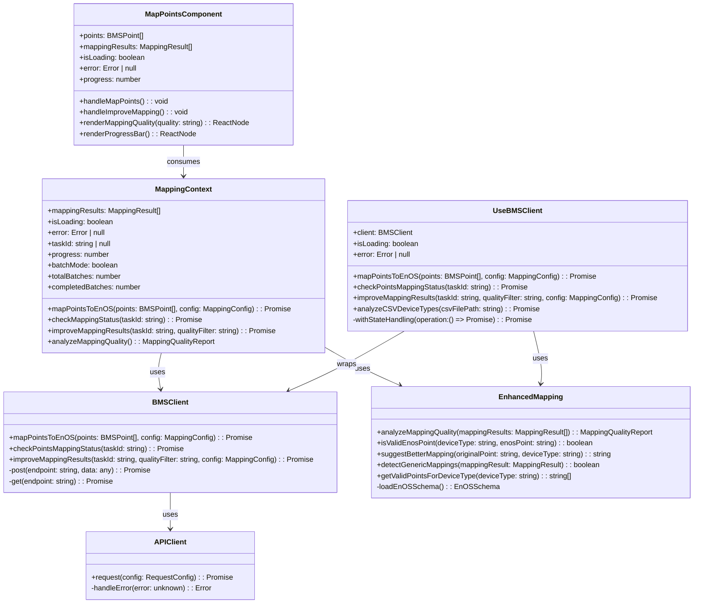
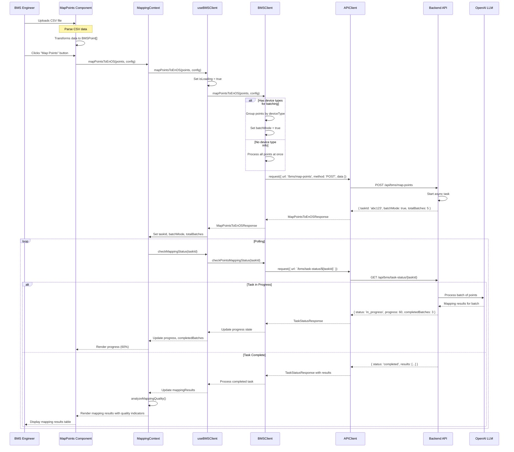
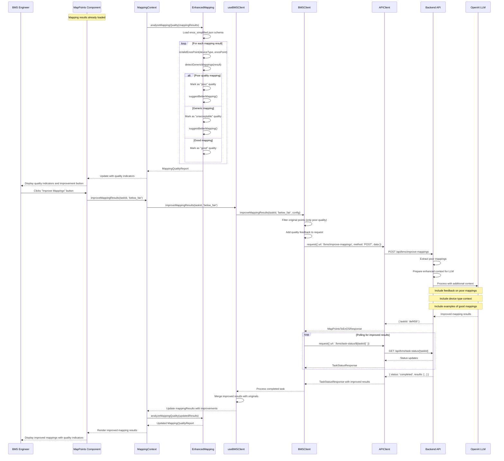
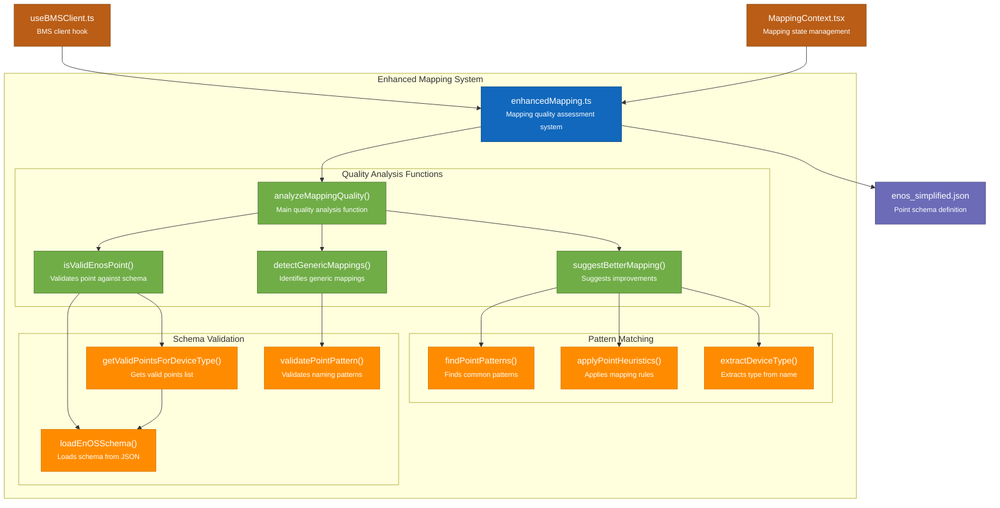
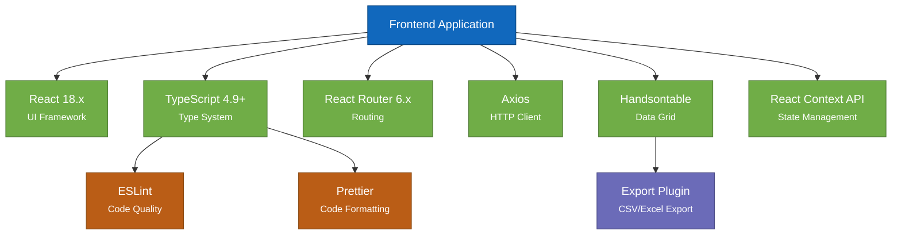

# Frontend Architecture C4 Model (Detailed)

## Level 1: System Context Diagram

**Elements:**
- **BMS Engineer**: Domain expert who needs to onboard BMS points to the EnOS system
- **BMS Onboarding Frontend**: React application that provides the UI for the onboarding workflow
- **BMS Onboarding Backend**: Python Flask application that processes BMS data and communicates with LLMs
- **OpenAI LLM Service**: External API service that provides AI capabilities for mapping and grouping
- **EnOS Platform**: Target platform where the BMS points will be integrated
- **Building Management System**: Source system containing raw BMS points data

**Relationships:**
- BMS Engineer interacts with the Frontend to upload, group, and map BMS points
- Frontend communicates with Backend for data processing and AI services
- Backend communicates with OpenAI for AI processing of point data
- Backend communicates with EnOS to validate target point structures
- BMS Engineer extracts data from BMS systems
- Backend can directly import data from some BMS systems

## Level 2: Container Diagram

**Elements:**
- **React Application**: Main frontend SPA built with React and TypeScript
- **API Client**: Type-safe client for backend communication
- **BMS API**: Handles BMS data retrieval operations
- **Grouping API**: Handles point grouping operations
- **Mapping API**: Handles point mapping operations
- **Export API**: Handles file export operations
- **Backend Server**: Python Flask application that implements the API endpoints

## Level 3: Component Diagram (Detailed)

## Level 4: Detailed Component Diagram (MappingContext Flow)

## Code-Level Diagram: Mapping Enhancement System

## Data Flow Diagram: First-Round Mapping Process

## Data Flow Diagram: Second-Round Mapping Improvement Process

## Component Detail: Enhanced Mapping System

## Implementation Status (Detailed)

| Phase | Task | Status | Details |
|-------|------|--------|---------|
| **1. Setup and Configuration** | Configure TypeScript | ✅ Complete | Strict typing, no implicit any |
| | Set up project structure | ✅ Complete | Feature-based organization |
| | Configure API client | ✅ Complete | Type-safe request/response handling |
| **2. Core Components and State** | Points Context | ✅ Complete | Global state for points data |
| | Mapping Context | ✅ Complete | State management for mapping operations |
| | BMS Client | ✅ Complete | BMS-specific API client |
| **3. Feature Implementation** | T1: Mapping Quality Assessment | ✅ Complete | Added quality analysis and validation |
| | | | - analyzeMappingQuality function |
| | | | - Schema validation |
| | | | - Generic mapping detection |
| | | | - Quality indicators (good/fair/poor) |
| | T2: CSV/JSON Parsing | ❌ Not Started | Tools for parsing input data |
| | T3: MapPoints Page | ❌ Not Started | UI for mapping functionality |
| | T4: Data Grid Integration | ❌ Not Started | Displaying mapping results |
| | T5: Second-round Mapping | ✅ Complete | Enhanced mapping improvements |
| | | | - improveMappingResults method |
| | | | - Quality feedback mechanism |
| | | | - Suggestion system |
| | T6: Batch Processing | ✅ Complete | Process points in batches |
| | | | - Device type analysis |
| | | | - Progress tracking |
| | | | - Batch mode API support |
| | T7: Export Functionality | ❌ Not Started | Exporting mapping results |
| **4. Cross-Domain Adaptability** | Protocol Adapters | ❌ Not Started | Support for different data sources |
| | Dynamic UI | ❌ Not Started | Adaptable UI components |
| | Template Configuration | ❌ Not Started | Configurable mapping templates |
| **5. Testing and Optimization** | Unit Tests | ❌ Not Started | Component and function tests |
| | Integration Tests | ❌ Not Started | End-to-end workflow tests |
| | Performance Optimization | ❌ Not Started | Improve rendering and processing |

## Technical Dependencies

